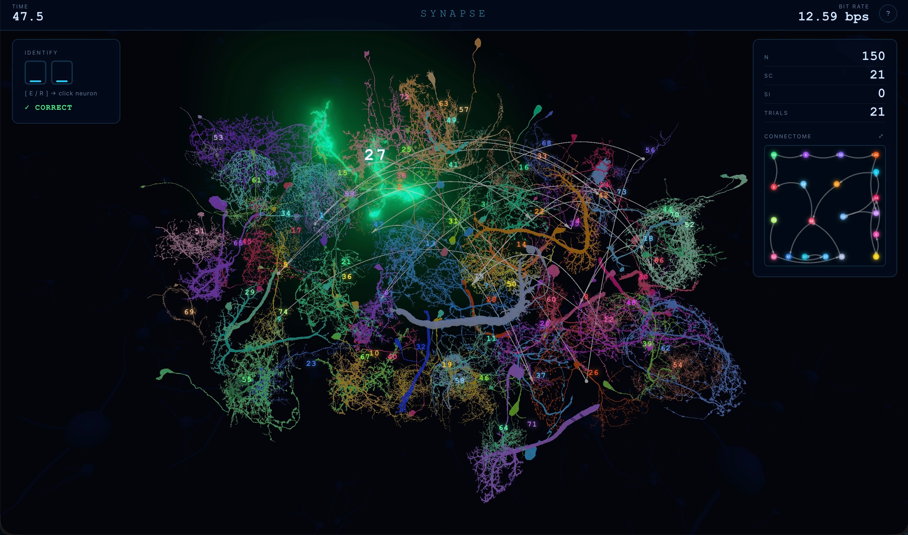

# SYNAPSE: 3D neural connectome construction bit-rate game

A **connectome** is a map of the synaptic connections in a nervous system. It is essentially a directed graph, where every node is a neuron and every edge is a synapse with a sign: excitatory (E) or inhibitory (I). Building one from experimental data means observing a neuron firing and identifying which type of connection it forms. This game is inspired from that identification task: *which neuron, what type of synapse?*

## The game

Each trial, a neuron in the 3D scene begins to fire. It glows green if it will form an excitatory synapse, or red if inhibitory. The user classifies it by pressing `E` or `R` on the keyboard and clicking the glowing neuron. A correct answer adds a labelled directed edge to the live connectome graph on the right panel. After 60 seconds, the bit rate is reported.

Note: the game does not carry any true connectomic information. Though the neurons are real, the firing sequence is i.i.d., neuron labels are drawn uniformly at random, and synapse types are assigned with equal probability.

## Inspiration

My idea for this game was inspired by my previous work in connectomics and computational neuroscience. I’ve worked on building data infrastructure for connectomics, developing analysis tooling for large-scale neuroimaging datasets and working directly with the kinds of 3D neuronal reconstructions rendered in this interface. I’ve also built dynamical systems models of interacting excitatory and inhibitory neural populations underlying sleep-state regulation, studying how REM- and non-REM-promoting populations mutually inhibit one another and how network architecture gives rise to emergent dynamics. I thought it would be fun to combine those perspectives into this interactive neuronal connectome game!

The visual design is inspired by **[Neuroglancer](https://neuroglancer.bossdb.io/#!%7B%22dimensions%22:%7B%22x%22:%5B2e-9%2C%22m%22%5D%2C%22y%22:%5B2e-9%2C%22m%22%5D%2C%22z%22:%5B3e-8%2C%22m%22%5D%7D%2C%22position%22:%5B6633.94091796875%2C4380.51025390625%2C345.5%5D%2C%22crossSectionScale%22:6.889510241581297%2C%22projectionOrientation%22:%5B-0.19058717787265778%2C0.3318977952003479%2C0.05980800837278366%2C0.9219237565994263%5D%2C%22projectionScale%22:7028.804970079241%2C%22layers%22:%5B%7B%22type%22:%22image%22%2C%22source%22:%22precomputed://s3://bossdb-open-data/witvliet2020/Dataset_5/em%22%2C%22tab%22:%22source%22%2C%22name%22:%22em%22%7D%2C%7B%22type%22:%22segmentation%22%2C%22source%22:%22precomputed://s3://bossdb-open-data/witvliet2020/Dataset_5_Segmentation/segmentation%22%2C%22tab%22:%22source%22%2C%22segments%22:%5B%22100%22%2C%2211%22%2C%2212%22%2C%22173%22%2C%22191%22%2C%2223%22%5D%2C%22name%22:%22segmentation%22%7D%2C%7B%22type%22:%22segmentation%22%2C%22source%22:%22precomputed://s3://bossdb-open-data/witvliet2020/Dataset_5_Segmentation/synapses%22%2C%22tab%22:%22source%22%2C%22segments%22:%5B%5D%2C%22name%22:%22synapses%22%7D%2C%7B%22type%22:%22segmentation%22%2C%22source%22:%22precomputed://https://s3.amazonaws.com/bossdb-open-data/mesh/witvliet2020/Dataset_5_Mesh%22%2C%22tab%22:%22source%22%2C%22linkedSegmentationGroup%22:%22segmentation%22%2C%22name%22:%22Dataset_5_Mesh%22%7D%2C%7B%22type%22:%22segmentation%22%2C%22source%22:%22precomputed://s3://bossdb-open-data/bae2024/witvliet/dataset5/mito_seg_v4%22%2C%22tab%22:%22source%22%2C%22segments%22:%5B%5D%2C%22name%22:%22mito_seg_v4%22%7D%5D%2C%22selectedLayer%22:%7B%22visible%22:true%2C%22layer%22:%22mito_seg_v4%22%7D%2C%22layout%22:%224panel%22%7D)**, a WebGL tool used to visualize connectomics datasets and neuron morphologies in 3D. Tools like Neuroglancer have made it possible for researchers to load a fly neuron, trace its axon across a brain hemisphere, and map every synapse it forms, all in a browser. SYNAPSE essentially takes a similar 3D morphology view and turns the identification task into a timed game.

The neuron meshes rendered in the 3D space are all real! They were sourced from the Janelia FlyEM connectome datasets, covering three published *Drosophila* reconstructions:

| Labels | Source | Description |
|--------|--------|-------------|
| 1–27 | FlyEM Male CNS v0.9 | Full central nervous system |
| 28–50 | Janelia Hemibrain v1.2 | Right hemisphere brain |
| 51–75 | MANC v1.2 | Male adult nerve cord |

When a mesh OBJ is on disk (fetched by `setup_meshes.py` via CloudVolume), the real reconstructed morphology is rendered and normalized to a common coordinate frame.

## Choice of N

The selection space has two dimensions: **75 neurons × 2 synapse types → N = 150**, giving log₂(149) ≈ **7.22 bits per correct selection**.

The choice of 75 neurons came from wanting the scene to feel like a real neural population rather than a small panel of buttons, while still keeping the interface visually navigable within a single viewport. It also pushes the information ceiling beyond what a simple keyboard- or click-based task would typically allow. Distributing the 75 neurons across three connectome sources adds morphological variety as well, since CNS, hemibrain, and nerve cord neurons each have distinct structural characteristics.

From testing my own bit rates, I found that the two-part answer form (type key + neuron click) did not add cognitive load proportional to N, because the target is always visually singular. Each trial, exactly one neuron is firing, represented by glowing at high emissive intensity against 74 dimmer foreground neurons. Hence, our visual system can locate it via pop-out, not search. Therefore, increasing the number of neurons as long as each individual neuron is still visible, raises the information content per trial without changing how long it takes to find the target. The spatial layout was also designed to reinforce this, so that neurons can be distributed across a 3D volume such that they overlap less in the screen space, and the scene can be orbited between trials. 

## Input modality

The game is designed for two-handed simultaneous input: one hand on the keyboard, one hand on the mouse/trackpad navigating the 3D scene, another decision made to optimize bit-rate.  

A keyboard-only game (e.g., press a letter key) or a click-only game (e.g., click a target on a grid) are both single-channel inputs. SYNAPSE combines them: the type classification (`E`/`R`) and the spatial selection (mouse click) happen across two hands, roughly in parallel. The result carries more bits per unit time than either channel alone could deliver, because both components of the answer are resolved simultaneously rather than sequentially.

The choice of letters `E` (for excitatory) and `R` (for repressive) was deliberate, so the keyboard hand would never have to move on a standard QWERTY keyboard, while the mouse hand can point and click at the neuron in parallel.

## As a motor and perceptual test

This game probes many of the same motor and perceptual demands present in typing-based BCI tasks. Each trial begins with a rapid color-based classification, where a green or red glow maps directly to neuron type, requiring the user to respond to a visual stimulus under time pressure. The interaction is also intentionally bimanual: one hand resolves neuron type through a simple categorical keyboard input, while the other simultaneously resolves spatial identity through more precise mouse targeting. Because these subtasks occur in parallel, the game measures how efficiently a user can transform visual classification into coordinated motor output, combining reaction time, hand-eye coordination, and spatial localization.

## Running

```bash
bash run.sh
# then open http://localhost:5050
```

`run.sh` creates a Python virtualenv, installs Flask and NumPy, and starts the server. The browser client uses Three.js loaded from a CDN import map.

The neuron mesh OBJ files are already loaded in `frontend/static/meshes`, and were retrieved via **[cloud-volume](https://github.com/seung-lab/cloud-volume)** through the `setup_meshes.py` script. 

## Codebase

```
SYNAPSE/
├── run.sh                  # one-command launcher
├── requirements.txt        # flask, numpy
├── neuron_config.json      # neuron labels: connectome body IDs, per dataset source
├── setup_meshes.py         # fetches OBJ meshes FlyEM sources via CloudVolume
├── backend/
│   └── app.py              # Flask: serves index.html, static files, /api/mesh-manifest
└── frontend/
    ├── index.html          # shell + Three.js CDN import map
    └── static/
        ├── css/style.css   # HUD layout, neuron labels, animations, result screen
        ├── meshes/         # *.obj mesh files
        └── js/
            ├── main.js     # entry point: scene, UI, game, network
            ├── game.js     # game loop, bit-rate formula, i.i.d. trial sequence
            ├── scene.js    # Three.js scene, camera, bloom post-processing, raycasting
            ├── neurons.js  # positions, colors, procedural geometry, OBJ mesh loader
            ├── effects.js  # firing animation, synapse arc particles, bloom queue
            ├── network.js  # force-directed connectome graph rendered on Canvas 2D
            └── ui.js       # HUD: timer, bit rate, input buffer slots, end summary
```

**Game loop:** `game.js` pre-generates 400 i.i.d. trials at session start. Each is `{ letter, type }` drawn uniformly. Bit rate updates once per second via `requestAnimationFrame`, using:

```
B = log2(N − 1) × max(Sc − Si, 0) / t     (Shenoy et al. 2021)
```

**Rendering:** Three.js WebGL with an `EffectComposer` post-processing stack. `UnrealBloomPass` produces neon glow effect: each neuron mesh has an emissive material, and when a neuron fires, its emissive intensity is cranked up so the bloom pass spreads that light into a halo. 

**Scene navigation:**  Three.js `TrackballControls` enables click drag rotation freely in any direction and scroll wheel zooms in and out. This lets the user navigate through the scene, inspect morphologies up-close, and reorient the space between trials to resolve any depth ambiguity between nearby neurons.

**Synapse arcs:** when a selection is made, `effects.js` spawns a  Bézier arc from the source neuron to the next target, capped with an arrowhead (E) or sphere (I) at the synapse terminal.

**Network graph:** `network.js` runs a force-directed layout on a Canvas 2D overlay. Nodes enter when a neuron first fires; edges are drawn as quadratic Bézier curves with arrowheads (E) or filled circles (I), following standard connectome diagram convention. Correct edges render bright, incorrect ones are dimmed.
